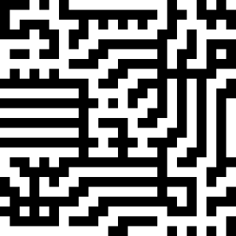

# Kuf

Kuf is a small library for generating
[square kufic calligraphy](https://en.wikipedia.org/wiki/Kufic#Square_Kufic).
At it's core is a constraint solver that ensures that
tessellations produced are "technically correct"
kufic patterns with no violation patterns.

Kufic has two major approaches to creating tessellations:
correction and generation. Generation will produce a small
pattern (up to 8x8) from scratch. Correction will example
a premade tessellation pattern and make changes to it to
ensure that it complies with the basic rules of square
geometric kufic.

Kuf is written in a literate style using
[worgle](https://pbat.ch/proj/worgle). This must be installed
before attempting to build. The kuf project tangles to
ANSI C. A standard C compiler with Make is required.

To build the project, run "make". This will build the
example program "example", which runs a series of test
programs and writes some files in the PBM format. The
most interesting of these files is currently "correct2.pbm".

As a literate program, the woven kuf program can also be
consumed online at the [loom](https://pbat.ch/proj/loom).

